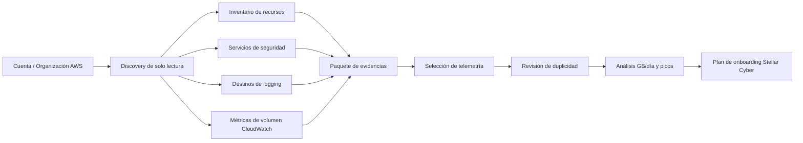
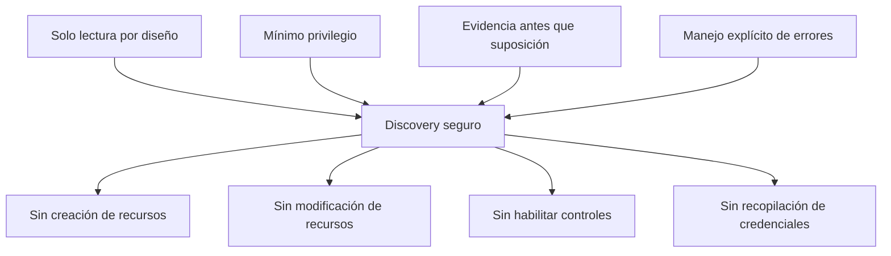
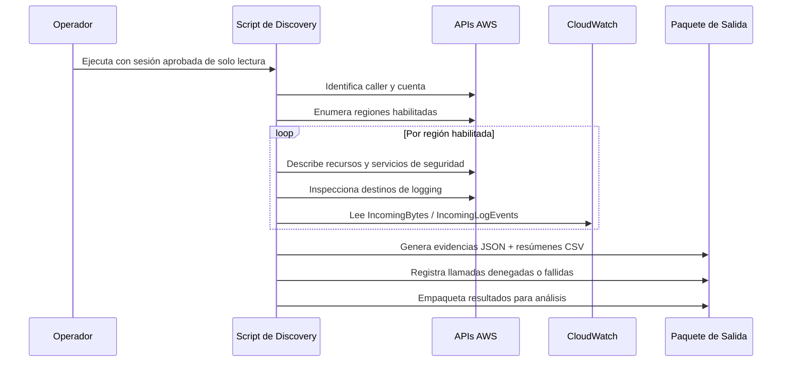
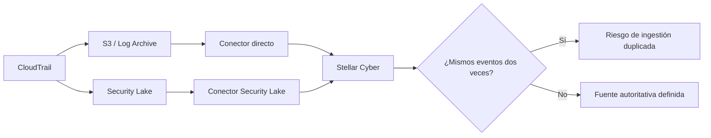
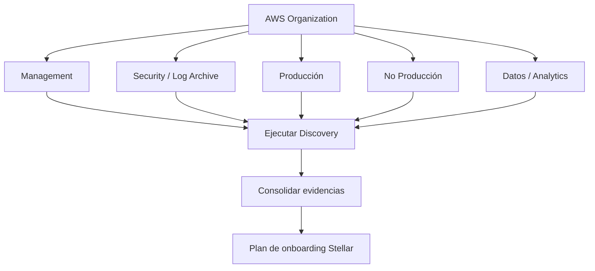
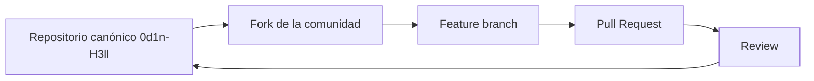

<p align="center">
  
</p>

<h1 align="center">AWS Stellar Cyber Discovery</h1>

<p align="center">
  <strong>ODIN // HELL</strong><br>
  <code>0d1n-H3ll</code><br>
  <code>ODH-ASD · hell.odin.aws.discovery · v1.0.0</code>
</p>

<p align="center">
  Toolkit AWS de solo lectura para evaluación de telemetría de seguridad, análisis de rutas de logging y dimensionamiento basado en evidencias para Stellar Cyber.
</p>

<p align="center">
  <strong>Idiomas:</strong>
  <a href="README.md">English</a> ·
  <a href="README.pt-BR.md">Português (Brasil)</a> ·
  Español
</p>

<p align="center">
  <a href="LICENSE"></a>
  
  
  
  
</p>

> El `README.md` en inglés es la documentación canónica. Esta versión en español se mantiene como traducción equivalente para la comunidad.

---

## Descripción general

`aws-stellar-discovery` ejecuta un discovery técnico de solo lectura sobre cuentas AWS para establecer una línea base defendible para onboarding de telemetría de seguridad y dimensionamiento SIEM/XDR.

Antes de conectar un entorno AWS a una plataforma de seguridad, los equipos necesitan saber **qué existe, qué ya registra logs, dónde se almacena la telemetría, cuánto volumen produce y qué ruta de recopilación debe considerarse autoritativa**.

La herramienta está diseñada para responder cinco preguntas:

1. **¿Qué recursos AWS relevantes para seguridad existen?**
2. **¿Qué servicios nativos de seguridad y logging están habilitados?**
3. **¿A dónde se envía actualmente cada fuente de telemetría?**
4. **¿Qué volumen recibe CloudWatch Logs durante el período seleccionado?**
5. **¿Qué fuentes deben incorporarse sin crear ingestión duplicada ni consumo innecesario de licencia?**

> [!IMPORTANT]
> Este proyecto es una utilidad de discovery y sizing. **No** es un escáner de compliance, un escáner de vulnerabilidades, un reemplazo de CSPM ni una prueba de cumplimiento regulatorio.

## Arquitectura



El script **no modifica el entorno AWS**. Sus resultados apoyan decisiones de arquitectura, sizing, onboarding y gobernanza.

## Modelo de seguridad



La implementación canónica utiliza APIs AWS de lectura, listado y descripción, además de recuperación de métricas de CloudWatch. No busca ejecutar operaciones de creación, actualización, habilitación, deshabilitación, eliminación, asociación u otras operaciones mutables.

Un servicio inaccesible no debe considerarse automáticamente ausente. Respuestas `AccessDenied`, regiones no soportadas y otras fallas de recopilación se registran para revisión separada.

Los artefactos generados pueden contener IDs de cuenta AWS, ARNs, nombres de recursos, buckets, identificadores de red, metadatos VPC/subnet, destinos de logging e indicadores de topología. Trate los paquetes de salida como **evidencia técnica sensible al entorno**.

## Alcance del discovery

| Dominio | Servicios / recursos AWS |
|---|---|
| Organización e identidad | Metadatos de AWS Organizations, resumen IAM, alias de cuenta |
| Compute | EC2, Lambda, EKS, ECS |
| Red | VPC, subnets, ENIs, Security Groups, NACLs, tablas de rutas, NAT Gateway, Transit Gateway, VPN, Direct Connect, VPC Endpoints |
| Telemetría de red | VPC Flow Logs, Network Firewall logging |
| Edge y entrega | ELB/ALB/NLB, CloudFront, API Gateway, AWS WAF |
| Datos | RDS/Aurora, DynamoDB, Redshift, ElastiCache, S3, EFS, FSx |
| Eventos e integración | Kinesis, Firehose, SQS, SNS, EventBridge |
| Auditoría y observabilidad | CloudTrail, CloudWatch Log Groups, subscription filters, AWS Config |
| Seguridad | GuardDuty, Security Hub, Inspector, Macie, Security Lake |
| DNS | Route 53 y Resolver Query Logging |

## Flujo de discovery



## Metodología de sizing de telemetría

Para cada CloudWatch Log Group, la herramienta consulta las métricas oficiales `AWS/Logs`:

- `IncomingBytes`
- `IncomingLogEvents`

La ventana por defecto es de **30 días**.

```text
GB/día promedio = SUM(IncomingBytes) / 1.073.741.824 / número_de_días
GB/hora pico    = MAX(SUM horario de IncomingBytes)) / 1.073.741.824
EPS pico         ≈ MAX(SUM horario de IncomingLogEvents)) / 3600
```

> [!NOTE]
> `IncomingBytes` es una buena línea base de ingestión en CloudWatch, pero **no equivale automáticamente** al volumen final licenciado en Stellar Cyber. El sizing final debe reflejar únicamente la telemetría seleccionada para onboarding y validarse durante la implementación o POC.

## Análisis de ingestión duplicada



Deben revisarse escenarios como CloudTrail directo + Security Lake, VPC Flow Logs por CloudWatch + Security Lake, WAF directo + Security Lake, GuardDuty directo + rutas agregadas de findings y application logs reenviados mediante múltiples subscriptions o collectors.

El archivo `log_source_destination_matrix.csv` está diseñado para apoyar esta decisión.

## Flujo multi-account

En entornos con IAM Identity Center / AWS Access Portal, ejecute el mismo script en cada cuenta objetivo utilizando un permission set aprobado de solo lectura.



En entornos centralizados, comience por las cuentas de management, security y log archive. CloudTrail organizacional, Security Lake o logging centralizado en S3 pueden reducir significativamente la cantidad de rutas de integración directa necesarias.

## Requisitos

- AWS CloudShell o shell Linux;
- AWS CLI v2;
- `jq`;
- `awk`;
- `sha256sum`;
- credenciales AWS autenticadas o sesión mediante IAM Identity Center;
- permisos de lectura aprobados para los servicios evaluados.

## Uso

```bash
chmod +x aws_stellar_discovery.sh
./aws_stellar_discovery.sh --days 30
```

Directorio de salida personalizado:

```bash
./aws_stellar_discovery.sh --days 30 --output ./assessment-account-01
```

Información de versión:

```bash
./aws_stellar_discovery.sh --version
```

## Principales artefactos generados

| Archivo | Propósito |
|---|---|
| `resource_counts.csv` | Conteo de recursos por cuenta, región y servicio |
| `cloudwatch_volume_<N>d.csv` | Métricas de volumen y eventos de CloudWatch |
| `log_source_destination_matrix.csv` | Mapea fuentes de telemetría y destinos actuales |
| `stellar-sizing-summary.txt` | Línea base inicial de ingestión/sizing |
| `metadata.json` | Identidad de la herramienta, procedencia y metadatos de ejecución |
| `errors/errors.log` | Llamadas denegadas, servicios no disponibles y errores de recopilación |
| `global/` | Evidencia JSON global o de cuenta |
| `regions/<region>/` | Evidencia JSON regional |

Una recopilación exitosa **no significa** que todas las fuentes deban incorporarse. Clasifique la telemetría según el caso de uso:

```text
CRITICAL -> necesaria para detección / auditoría / investigación
HIGH     -> mejora significativamente la visibilidad
CONTEXT  -> enriquecimiento o evidencia de apoyo
OPTIONAL -> valor limitado para el caso de uso
EXCLUDE  -> duplicada, innecesaria, excesiva o fuera de alcance
```

## Alineación con normas, frameworks y requisitos regulatorios

El proyecto se diseñó considerando prácticas reconocidas de seguridad de la información y seguridad cloud. Esto significa **alineación de intención de diseño**, no certificación ni cumplimiento automático.

| Referencia | Relevancia |
|---|---|
| AWS Well-Architected Framework — Security Pillar | mínimo privilegio, separación de funciones, gobernanza y observabilidad segura |
| NIST Cybersecurity Framework 2.0 | Govern, Identify, Protect, Detect, Respond y Recover; gestión de riesgo basada en evidencias |
| CIS Amazon Web Services Foundations Benchmark | baseline de seguridad AWS y expectativas sobre logging y servicios de seguridad |
| ISO/IEC 27001:2022 | principios de SGSI y gestión de riesgos basada en contexto |
| ISO/IEC 27002:2022 | logging, control de acceso, monitorización y protección de la información |
| LGPD — Lei nº 13.709/2018 | necesidad, seguridad, prevención y responsabilidad cuando la evidencia contiene datos personales |

Consulte [`docs/COMPLIANCE.md`](docs/COMPLIANCE.md) para referencias y orientación de interpretación.

## Identidad y procedencia del proyecto

| Campo | Valor |
|---|---|
| Project ID | `ODH-ASD` |
| Namespace | `hell.odin.aws.discovery` |
| Owner / maintainer | `0d1n-H3ll` |
| Repositorio canónico | `0d1n-H3ll/aws-stellar-discovery` |
| Serie de releases | `ODH-ASD` |
| Versión pública inicial | `v1.0.0` |
| Provenance ID | `ODH-ASD-1.0.0-7D3F9A21` |

El runtime deriva un fingerprint SHA-256 determinista a partir del namespace, Project ID, versión y Provenance ID. La procedencia a nivel de repositorio se registra en [`.provenance`](.provenance).

No se utilizan mecanismos ocultos u ofuscados como método de atribución; la procedencia es explícita y auditable.

## Distribución para la comunidad

Este repositorio es la **fuente canónica** del proyecto:

```text
https://github.com/0d1n-H3ll/aws-stellar-discovery
```

Profesionales de seguridad, partners y miembros de la comunidad Stellar Cyber pueden **hacer fork, evaluar y mejorar** el proyecto bajo Mozilla Public License 2.0.

Para redistribución comunitaria, se recomienda usar **Fork** de GitHub en lugar de copiar el código a un repositorio sin relación. El fork preserva el origen visible y facilita contribuciones upstream.



## Contribuciones

Issues y Pull Requests son bienvenidos. Las contribuciones deben preservar el modelo de solo lectura y no pueden introducir recopilación oculta, captura de credenciales, operaciones de escritura ni información específica de clientes.

Consulte [`CONTRIBUTING.md`](CONTRIBUTING.md).

## Licencia y atribución

Copyright © 2026 `0d1n-H3ll`.

El código fuente se distribuye bajo [Mozilla Public License 2.0](LICENSE). Consulte [`NOTICE`](NOTICE) para identidad del proyecto, fuente canónica y avisos de marcas.

## Aviso legal

Este es un proyecto independiente de la comunidad. No es un producto oficial de Amazon Web Services ni de Stellar Cyber y no está respaldado por dichas empresas. Los nombres de productos y marcas pertenecen a sus respectivos titulares.
