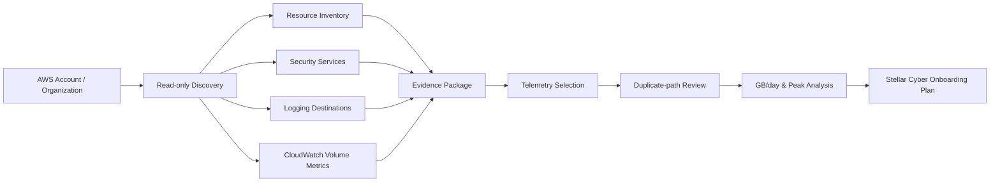
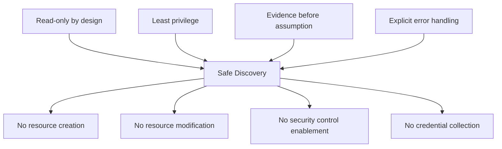
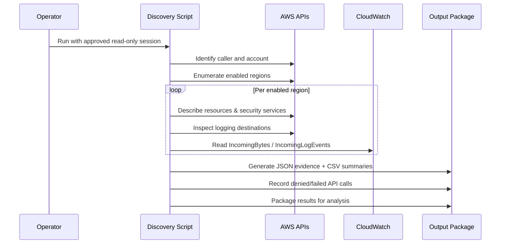
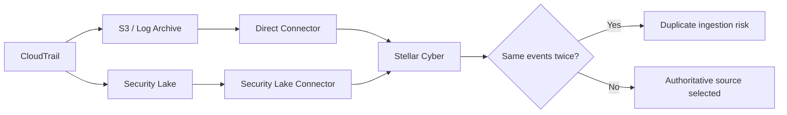
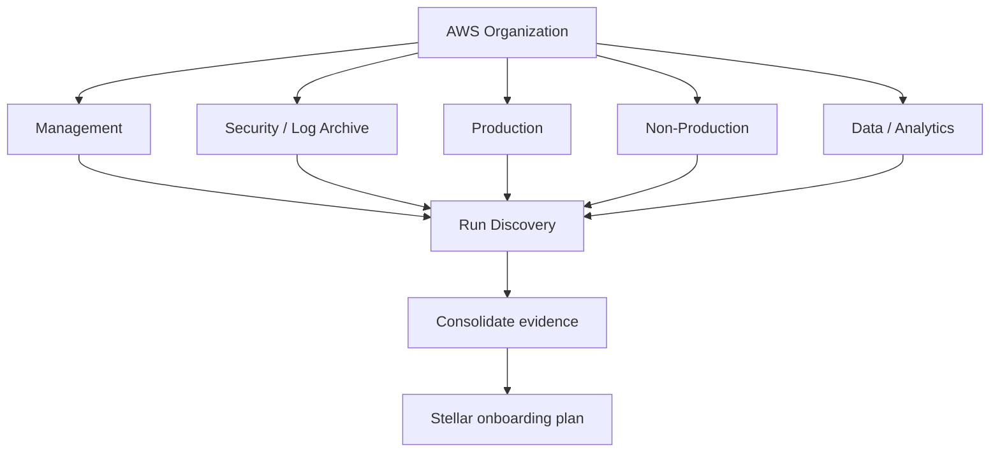
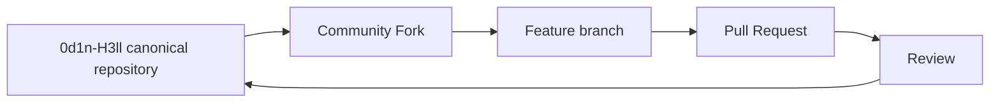

<p align="center">
  
</p>

<h1 align="center">AWS Stellar Cyber Discovery</h1>

<p align="center">
  <strong>ODIN // HELL</strong><br>
  <code>0d1n-H3ll</code><br>
  <code>ODH-ASD · hell.odin.aws.discovery · v1.0.0</code>
</p>

<p align="center">
  Read-only AWS discovery toolkit for security telemetry assessment, logging-path analysis and evidence-based Stellar Cyber sizing.
</p>

<p align="center">
  <strong>Languages:</strong>
  English ·
  <a href="README.pt-BR.md">Português (Brasil)</a> ·
  <a href="README.es.md">Español</a>
</p>

<p align="center">
  <a href="LICENSE"></a>
  
  
  
  
</p>

> The English README is the canonical documentation. The Portuguese and Spanish versions are maintained as equivalent community translations.

---

## Overview

`aws-stellar-discovery` performs a read-only technical discovery of AWS accounts to establish a defensible baseline for security telemetry onboarding and SIEM/XDR sizing.

The practical problem is simple: before connecting an AWS estate to a security platform, teams need to know **what exists, what is already logging, where telemetry is stored, how much it produces and which collection path should be authoritative**.

The tool is designed to answer five questions:

1. **What security-relevant AWS resources exist?**
2. **Which native logging and security services are enabled?**
3. **Where does each telemetry source currently go?**
4. **What volume is CloudWatch Logs receiving over the selected lookback period?**
5. **Which sources should be onboarded without creating duplicate ingestion or unnecessary license consumption?**

> [!IMPORTANT]
> This project is a discovery and sizing utility. It is **not** a compliance scanner, vulnerability scanner, CSPM replacement or proof of regulatory compliance.

## Architecture



The script does **not** change the AWS environment. Its output supports architecture, sizing, onboarding and governance decisions.

## Security model



The canonical implementation uses AWS read/list/describe APIs and CloudWatch metric retrieval. It does not intentionally call create, update, put, enable, disable, delete, attach, detach, associate or other mutating operations.

An inaccessible service is not automatically absent. `AccessDenied`, unsupported-region responses and other collection failures are recorded for separate review.

Generated evidence can contain AWS account IDs, ARNs, resource names, bucket names, network identifiers, VPC/subnet metadata, logging destinations and infrastructure topology indicators. Treat output packages as **environment-sensitive technical evidence**.

## Scope of discovery

| Domain | AWS services / resources |
|---|---|
| Organization & identity | AWS Organizations metadata, IAM account summary, account aliases |
| Compute | EC2, Lambda, EKS, ECS |
| Network | VPC, subnets, ENIs, Security Groups, NACLs, route tables, NAT Gateway, Transit Gateway, VPN, Direct Connect, VPC Endpoints |
| Network telemetry | VPC Flow Logs, Network Firewall logging |
| Edge & delivery | ELB/ALB/NLB, CloudFront, API Gateway, AWS WAF |
| Data | RDS/Aurora, DynamoDB, Redshift, ElastiCache, S3, EFS, FSx |
| Event & integration | Kinesis, Firehose, SQS, SNS, EventBridge |
| Audit & observability | CloudTrail, CloudWatch Log Groups, subscription filters, AWS Config |
| Security | GuardDuty, Security Hub, Inspector, Macie, Security Lake |
| DNS | Route 53 hosted zones and Resolver query logging |

## Discovery flow



## Telemetry sizing methodology

For each CloudWatch Log Group the tool reads the official `AWS/Logs` metrics:

- `IncomingBytes`
- `IncomingLogEvents`

The default lookback window is **30 days**.

```text
Average GB/day = SUM(IncomingBytes) / 1,073,741,824 / number_of_days
Peak GB/hour   = MAX(hourly SUM(IncomingBytes)) / 1,073,741,824
Peak EPS       ≈ MAX(hourly SUM(IncomingLogEvents)) / 3600
```

> [!NOTE]
> `IncomingBytes` is a strong CloudWatch ingestion baseline, but it is **not automatically equal** to final licensed ingestion volume in Stellar Cyber. Final sizing should reflect only the telemetry selected for onboarding and be validated during implementation or POC.

## Duplicate-ingestion analysis



Review cases such as CloudTrail direct + Security Lake, VPC Flow Logs via CloudWatch + Security Lake, WAF direct + Security Lake, GuardDuty direct + aggregated finding paths, or application logs forwarded through multiple subscriptions/collectors.

The generated `log_source_destination_matrix.csv` is intended to support this decision.

## Multi-account workflow

For estates using IAM Identity Center / AWS Access Portal, run the same script in each target account with an approved read-only permission set.



For centralized estates, begin with management/security/log-archive accounts. Organization-level CloudTrail, Security Lake or centralized S3 logging can materially reduce the number of direct integration paths required.

## Requirements

- AWS CloudShell or Linux shell;
- AWS CLI v2;
- `jq`;
- `awk`;
- `sha256sum`;
- authenticated AWS credentials or IAM Identity Center session;
- approved read permissions for the assessed services.

## Usage

```bash
chmod +x aws_stellar_discovery.sh
./aws_stellar_discovery.sh --days 30
```

Custom output directory:

```bash
./aws_stellar_discovery.sh --days 30 --output ./assessment-account-01
```

Version information:

```bash
./aws_stellar_discovery.sh --version
```

## Key outputs

| Output | Purpose |
|---|---|
| `resource_counts.csv` | Resource counts by account, region and service |
| `cloudwatch_volume_<N>d.csv` | CloudWatch volume and event metrics |
| `log_source_destination_matrix.csv` | Maps telemetry sources to current destinations |
| `stellar-sizing-summary.txt` | Initial ingestion/sizing baseline |
| `metadata.json` | Tool identity, provenance and execution metadata |
| `errors/errors.log` | Denied calls, unavailable services and collection errors |
| `global/` | Global/account-level JSON evidence |
| `regions/<region>/` | Regional JSON evidence |

A successful discovery does **not** mean every source should be onboarded. Classify telemetry according to the use case:

```text
CRITICAL -> required for detection / audit / investigation
HIGH     -> materially improves visibility
CONTEXT  -> useful enrichment or supporting evidence
OPTIONAL -> limited security value for the use case
EXCLUDE  -> duplicate, unnecessary, excessive or out of scope
```

## Standards, frameworks and regulatory alignment

The project design is informed by recognized security-management and cloud-security practices. This means **alignment in design intent**, not certification or automatic compliance.

| Reference | Relevance |
|---|---|
| AWS Well-Architected Framework — Security Pillar | least privilege, separation of duties, governance and secure observability |
| NIST Cybersecurity Framework 2.0 | Govern, Identify, Protect, Detect, Respond and Recover; evidence-based risk management |
| CIS Amazon Web Services Foundations Benchmark | AWS security baselines and logging/security-service expectations |
| ISO/IEC 27001:2022 | risk-based information security management system principles |
| ISO/IEC 27002:2022 | logging, access control, monitoring and information-protection practices |
| LGPD — Lei nº 13.709/2018 | necessity, security, prevention and accountability when evidence contains personal data |

See [`docs/COMPLIANCE.md`](docs/COMPLIANCE.md) for references and interpretation guidance.

## Project identity and provenance

| Field | Value |
|---|---|
| Project ID | `ODH-ASD` |
| Namespace | `hell.odin.aws.discovery` |
| Owner / maintainer | `0d1n-H3ll` |
| Canonical repository | `0d1n-H3ll/aws-stellar-discovery` |
| Release series | `ODH-ASD` |
| Initial public version | `v1.0.0` |
| Provenance ID | `ODH-ASD-1.0.0-7D3F9A21` |

The runtime derives a deterministic SHA-256 fingerprint from the namespace, project ID, version and provenance ID. Repository-level provenance is recorded in [`.provenance`](.provenance).

No hidden or obfuscated behavior is used as an authorship mechanism; provenance is explicit and auditable.

## Community distribution

This repository is the **canonical source** for the project:

```text
https://github.com/0d1n-H3ll/aws-stellar-discovery
```

Security professionals, partners and members of the Stellar Cyber community are welcome to **fork**, evaluate and improve the project under the Mozilla Public License 2.0.

For community redistribution, prefer a GitHub **Fork** instead of copying the source into an unrelated repository. A fork preserves the visible origin and simplifies upstream contributions.

Recommended community flow:



## Contributing

Issues and pull requests are welcome. Contributions must preserve the read-only security model and must not introduce hidden collection, credential harvesting, write operations or customer-specific information.

See [`CONTRIBUTING.md`](CONTRIBUTING.md).

## License and attribution

Copyright © 2026 `0d1n-H3ll`.

Source code is distributed under the [Mozilla Public License 2.0](LICENSE). See [`NOTICE`](NOTICE) for project identity, canonical-source and trademark notices.

## Disclaimer

This is an independent community project. It is not an official Amazon Web Services or Stellar Cyber product and is not endorsed by Amazon Web Services, Inc. or Stellar Cyber, Inc. Product names and trademarks belong to their respective owners.
