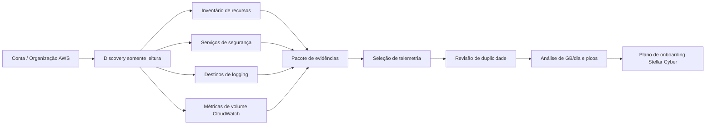
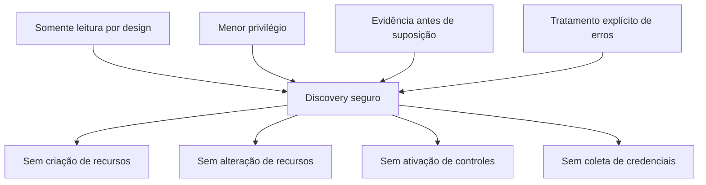
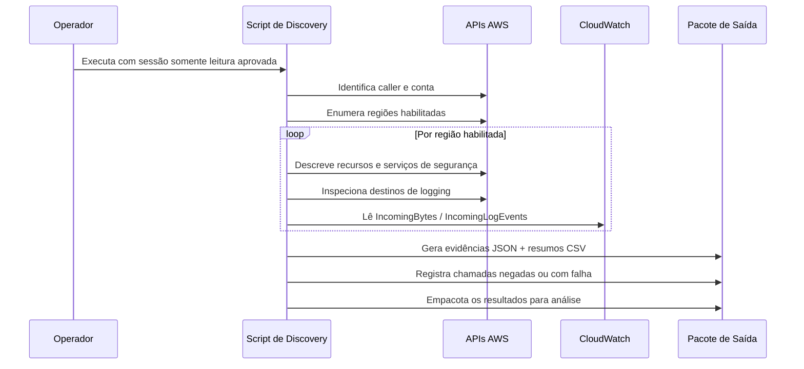
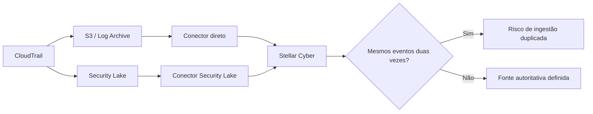
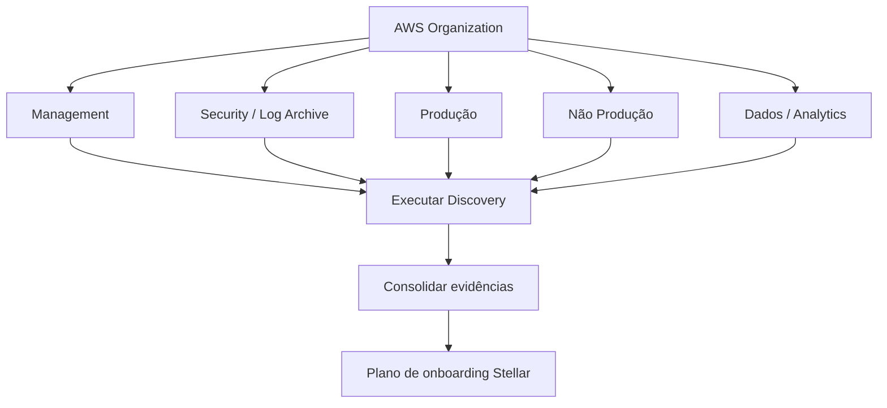
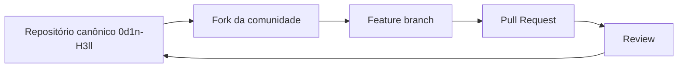

<p align="center">
  
</p>

<h1 align="center">AWS Stellar Cyber Discovery</h1>

<p align="center">
  <strong>ODIN // HELL</strong><br>
  <code>0d1n-H3ll</code><br>
  <code>ODH-ASD · hell.odin.aws.discovery · v1.0.0</code>
</p>

<p align="center">
  Toolkit somente leitura para discovery AWS, avaliação de telemetria de segurança, análise de caminhos de logging e dimensionamento baseado em evidências para Stellar Cyber.
</p>

<p align="center">
  <strong>Idiomas:</strong>
  <a href="README.md">English</a> ·
  Português (Brasil) ·
  <a href="README.es.md">Español</a>
</p>

<p align="center">
  <a href="LICENSE"></a>
  
  
  
  
</p>

> O `README.md` em inglês é a documentação canônica. Esta versão em português brasileiro é mantida como tradução equivalente para a comunidade.

---

## Visão geral

O `aws-stellar-discovery` executa um discovery técnico somente leitura em contas AWS para estabelecer uma linha de base defensável para onboarding de telemetria de segurança e dimensionamento de SIEM/XDR.

Antes de conectar um ambiente AWS a uma plataforma de segurança, é necessário saber **o que existe, o que já gera logs, onde a telemetria está armazenada, qual volume é produzido e qual caminho de coleta deve ser considerado autoritativo**.

A ferramenta foi criada para responder cinco perguntas:

1. **Quais recursos AWS relevantes para segurança existem?**
2. **Quais serviços nativos de logging e segurança estão habilitados?**
3. **Para onde cada fonte de telemetria está sendo enviada?**
4. **Qual volume o CloudWatch Logs recebeu no período selecionado?**
5. **Quais fontes devem ser integradas sem gerar ingestão duplicada ou consumo desnecessário de licença?**

> [!IMPORTANT]
> Este projeto é uma ferramenta de discovery e sizing. Ele **não** é scanner de compliance, scanner de vulnerabilidades, substituto de CSPM nem prova de conformidade regulatória.

## Arquitetura



O script **não altera o ambiente AWS**. Seus resultados apoiam decisões de arquitetura, sizing, onboarding e governança.

## Modelo de segurança



A implementação canônica utiliza APIs AWS de leitura, listagem e descrição, além da recuperação de métricas do CloudWatch. Não há intenção de executar operações de criação, atualização, habilitação, desabilitação, exclusão, associação ou outras operações mutáveis.

Um serviço inacessível não deve ser considerado automaticamente inexistente. Respostas `AccessDenied`, regiões não suportadas e outras falhas de coleta são registradas para análise separada.

Os artefatos gerados podem conter IDs de contas AWS, ARNs, nomes de recursos, buckets, identificadores de rede, metadados de VPC/subnet, destinos de logging e indicadores de topologia. Trate os pacotes de saída como **evidência técnica sensível ao ambiente**.

## Escopo do discovery

| Domínio | Serviços / recursos AWS |
|---|---|
| Organização e identidade | Metadados de AWS Organizations, resumo IAM, aliases de conta |
| Compute | EC2, Lambda, EKS, ECS |
| Rede | VPC, subnets, ENIs, Security Groups, NACLs, tabelas de rota, NAT Gateway, Transit Gateway, VPN, Direct Connect, VPC Endpoints |
| Telemetria de rede | VPC Flow Logs, Network Firewall logging |
| Edge e entrega | ELB/ALB/NLB, CloudFront, API Gateway, AWS WAF |
| Dados | RDS/Aurora, DynamoDB, Redshift, ElastiCache, S3, EFS, FSx |
| Eventos e integração | Kinesis, Firehose, SQS, SNS, EventBridge |
| Auditoria e observabilidade | CloudTrail, CloudWatch Log Groups, subscription filters, AWS Config |
| Segurança | GuardDuty, Security Hub, Inspector, Macie, Security Lake |
| DNS | Route 53 e Resolver Query Logging |

## Fluxo de discovery



## Metodologia de sizing de telemetria

Para cada CloudWatch Log Group, a ferramenta consulta as métricas oficiais `AWS/Logs`:

- `IncomingBytes`
- `IncomingLogEvents`

A janela padrão é de **30 dias**.

```text
GB/dia médio = SUM(IncomingBytes) / 1.073.741.824 / número_de_dias
GB/hora pico = MAX(SUM horário de IncomingBytes)) / 1.073.741.824
EPS pico      ≈ MAX(SUM horário de IncomingLogEvents)) / 3600
```

> [!NOTE]
> `IncomingBytes` é uma boa linha de base de ingestão do CloudWatch, mas **não equivale automaticamente** ao volume final licenciado no Stellar Cyber. O sizing final deve considerar somente a telemetria selecionada para onboarding e ser validado na implementação ou POC.

## Análise de ingestão duplicada



Devem ser revisados cenários como CloudTrail direto + Security Lake, VPC Flow Logs via CloudWatch + Security Lake, WAF direto + Security Lake, GuardDuty direto + caminhos agregados de findings e application logs encaminhados por múltiplas subscriptions ou collectors.

O arquivo `log_source_destination_matrix.csv` foi criado para apoiar essa decisão.

## Fluxo multi-account

Em ambientes com IAM Identity Center / AWS Access Portal, execute o mesmo script em cada conta-alvo utilizando um permission set somente leitura aprovado.



Em ambientes centralizados, comece pelas contas de management, security e log archive. CloudTrail organizacional, Security Lake e centralização em S3 podem reduzir significativamente a quantidade de integrações diretas necessárias.

## Requisitos

- AWS CloudShell ou shell Linux;
- AWS CLI v2;
- `jq`;
- `awk`;
- `sha256sum`;
- credenciais AWS autenticadas ou sessão via IAM Identity Center;
- permissões de leitura aprovadas para os serviços avaliados.

## Uso

```bash
chmod +x aws_stellar_discovery.sh
./aws_stellar_discovery.sh --days 30
```

Diretório de saída customizado:

```bash
./aws_stellar_discovery.sh --days 30 --output ./assessment-account-01
```

Informações de versão:

```bash
./aws_stellar_discovery.sh --version
```

## Principais artefatos gerados

| Arquivo | Finalidade |
|---|---|
| `resource_counts.csv` | Contagem de recursos por conta, região e serviço |
| `cloudwatch_volume_<N>d.csv` | Métricas de volume e eventos do CloudWatch |
| `log_source_destination_matrix.csv` | Mapeia fontes de telemetria e destinos atuais |
| `stellar-sizing-summary.txt` | Linha de base inicial de ingestão/sizing |
| `metadata.json` | Identidade da ferramenta, proveniência e metadados de execução |
| `errors/errors.log` | Chamadas negadas, serviços indisponíveis e erros de coleta |
| `global/` | Evidências JSON globais ou de conta |
| `regions/<region>/` | Evidências JSON regionais |

Uma coleta bem-sucedida **não significa** que todas as fontes devam ser integradas. Classifique a telemetria de acordo com o caso de uso:

```text
CRITICAL -> necessária para detecção / auditoria / investigação
HIGH     -> aumenta significativamente a visibilidade
CONTEXT  -> enriquecimento ou evidência complementar
OPTIONAL -> valor limitado para o caso de uso
EXCLUDE  -> duplicada, desnecessária, excessiva ou fora do escopo
```

## Alinhamento a normas, frameworks e requisitos regulatórios

O projeto foi estruturado com base em práticas reconhecidas de segurança da informação e segurança em nuvem. Isso representa **alinhamento de intenção de projeto**, e não certificação ou conformidade automática.

| Referência | Aplicação ao projeto |
|---|---|
| AWS Well-Architected Framework — Security Pillar | menor privilégio, segregação de funções, governança e observabilidade segura |
| NIST Cybersecurity Framework 2.0 | Govern, Identify, Protect, Detect, Respond e Recover; gestão de risco baseada em evidências |
| CIS Amazon Web Services Foundations Benchmark | baseline de segurança AWS e expectativas de logging e serviços de segurança |
| ISO/IEC 27001:2022 | princípios de SGSI e gestão de risco baseada em contexto |
| ISO/IEC 27002:2022 | logging, controle de acesso, monitoramento e proteção da informação |
| LGPD — Lei nº 13.709/2018 | necessidade, segurança, prevenção e responsabilização quando evidências contiverem dados pessoais |

Consulte [`docs/COMPLIANCE.md`](docs/COMPLIANCE.md) para referências e orientações de interpretação.

## Identidade e proveniência do projeto

| Campo | Valor |
|---|---|
| Project ID | `ODH-ASD` |
| Namespace | `hell.odin.aws.discovery` |
| Owner / maintainer | `0d1n-H3ll` |
| Repositório canônico | `0d1n-H3ll/aws-stellar-discovery` |
| Série de releases | `ODH-ASD` |
| Versão pública inicial | `v1.0.0` |
| Provenance ID | `ODH-ASD-1.0.0-7D3F9A21` |

O runtime deriva um fingerprint SHA-256 determinístico a partir do namespace, Project ID, versão e Provenance ID. A proveniência em nível de repositório está registrada em [`.provenance`](.provenance).

Não são utilizados mecanismos ocultos ou ofuscados para atribuição de autoria; a proveniência é explícita e auditável.

## Distribuição para a comunidade

Este repositório é a **fonte canônica** do projeto:

```text
https://github.com/0d1n-H3ll/aws-stellar-discovery
```

Profissionais de segurança, parceiros e membros da comunidade Stellar Cyber podem **fazer fork, avaliar e evoluir** o projeto nos termos da Mozilla Public License 2.0.

Para redistribuição comunitária, prefira **Fork** no GitHub em vez de copiar o código para um repositório sem vínculo. O fork preserva visualmente a origem e facilita contribuições upstream.



## Contribuições

Issues e Pull Requests são bem-vindos. Contribuições devem preservar o modelo somente leitura e não podem introduzir coleta oculta, captura de credenciais, operações de escrita ou dados específicos de clientes.

Consulte [`CONTRIBUTING.md`](CONTRIBUTING.md).

## Licença e atribuição

Copyright © 2026 `0d1n-H3ll`.

O código-fonte é distribuído sob a [Mozilla Public License 2.0](LICENSE). Consulte [`NOTICE`](NOTICE) para identidade do projeto, fonte canônica e avisos de marcas.

## Aviso legal

Este é um projeto independente da comunidade. Não é um produto oficial da Amazon Web Services ou da Stellar Cyber e não é endossado por essas empresas. Nomes de produtos e marcas pertencem aos respectivos titulares.
