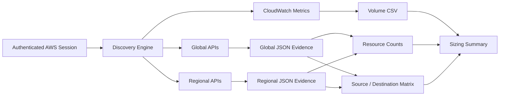

# Architecture

## Objective

The architecture is intentionally simple: obtain account and regional evidence through read-only AWS APIs, measure CloudWatch log-ingestion indicators, preserve raw JSON evidence and generate analysis-friendly CSV summaries.

## Trust boundaries

1. **Operator boundary** — AWS session is established outside the tool.
2. **AWS API boundary** — the script consumes AWS responses but does not manage credentials.
3. **Local evidence boundary** — outputs are written to the execution filesystem.
4. **External sharing boundary** — generated packages must be reviewed before leaving the authorized assessment context.

## Failure model

Collection failures are evidence. They are written to `errors/errors.log`. `AccessDenied` must never be treated as proof that a resource is absent.

## Read-only invariant

The canonical project must not intentionally introduce AWS API actions that mutate resources or security controls. Pull requests requiring write actions should be rejected or implemented as a separate, explicitly different tool.
